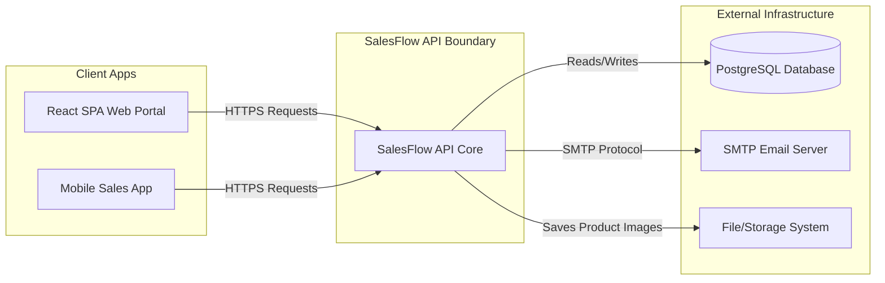

# 🏢 Enterprise Multitenant Sales & Order API
### 📂 Backend Architecture & Design Case Study


This repository serves as an **architectural showcase and design case study** of a production-grade backend developed for a multitenant Sales & Order Management platform. 

> [!NOTE]  
> The underlying source code of this application is proprietary and confidential. This repository is dedicated to documenting the architectural decisions, security standards, and advanced backend implementations used to build the system.

---

## 🚀 Executive Summary

The backend is built using **ASP.NET Core (C#)**, **Entity Framework Core**, and **PostgreSQL**. It acts as the core engine for ordering, inventory mappings, and order invoice generation for multiple independent organizations (tenants).

Instead of treating the backend as a collection of CRUD controllers, the architecture prioritizes **security-by-default, transactional consistency, and strict boundary control**:
*   **Preventing Cross-Tenant Data Leaks**: By automating tenant isolation at the ORM compilation layer, database queries are scoped implicitly—preventing catastrophic corporate data leaks.
*   **Maintaining Database Integrity**: Leverages Unit of Work scoping to ensure multi-entity updates (e.g., order headers, itemized breakdowns, and inventory allocations) succeed or roll back as an atomic unit, preventing corrupt inventory counts and partial order writes.
*   **Securing API Boundaries**: Global middleware catches exceptions and wraps outbound payloads into structured JSON contracts, preventing internal database stack traces from leaking to public networks and safeguarding endpoints against diagnostic vulnerability scans.
*   **Ensuring Thread-Safe Sequences**: Offloads concurrent order-number generation (`ORD-000001`) to database-level transactional locks, preventing duplicate identifiers under heavy peak sales traffic.

---

## 🖥️ Server Configuration (Dev/Staging)

All load tests were run against the API deployed on the following Oracle Cloud Infrastructure instance:

| Component | Specification |
|---|---|
| **Provider** | Oracle Cloud Infrastructure (OCI) — Always Free Tier |
| **Shape** | `VM.Standard.E2.1.Micro` (x86) |
| **OCPUs** | 1 OCPU (2 hyperthreaded vCPUs, shared physical core) |
| **RAM** | 1 GB |
| **Architecture** | AMD x86-64 |
| **Colocation** | .NET API + PostgreSQL on the **same VM** |
| **OS** | Ubuntu 22.04 LTS |

> [!NOTE]
> 1 OCPU in Oracle Cloud = 1 physical CPU core with hyperthreading enabled (2 vCPUs). Both the application server and database compete for this single core.

---

## 📈 System Scale & Load Context

The backend has been load-tested using **k6** against the most write-intensive endpoint (`POST /api/Order/Create`), which involves multi-table DB transactions.

*   **Multi-Tenancy Scale**: Safely isolates and supports **50+ active client organizations (tenants)** sharing a single database instance.
*   **Invoice Compilation Load**: Generates custom QuestPDF order invoices on-demand with minimized memory overhead.

> [!IMPORTANT]
> All numbers below reflect tests conducted on the **dev/staging server specified above**. Production hardware will yield significantly higher throughput.

---

## ⚡ Performance & Load Testing

### Test Conditions
- **Tool**: k6
- **Endpoint Tested**: `POST /api/Order/Create` (heaviest endpoint — involves DB transaction, bulk mapping lookup, multi-row insert)
- **Scenario**: Each virtual user (VU) logs in once, then continuously creates orders in a loop
- **Threshold**: Response under 500ms considered acceptable

---

### Results — 20 Concurrent Users ✅ Stable

| Metric | 2-Minute Run | 5-Minute Run |
|---|---|---|
| **HTTP Error Rate** | 0.00% | 0.00% |
| **Success Rate** | 99.76% | 99.72% |
| **Throughput** | 15.5 iter/s | 17.2 iter/s |
| **Median Response** | 45 ms | 64 ms |
| **p90 Response** | 72 ms | 130 ms |
| **p95 Response** | 91 ms | 156 ms |
| **Max Response** | 22.34 s | 20.27 s |
| **Failures (>500ms)** | 13 / 1,875 (0.7%) | 42 / 5,174 (0.8%) |

> [!NOTE]
> The high average (276ms / 158ms) is skewed by rare tail spikes (max ~22s). The median of 45–64ms reflects the true typical user experience. The 5-minute run's JIT-warmed throughput (17.2 iter/s) is slightly better than the cold-start 2-minute run (15.5 iter/s).

---

### Results — 30 Concurrent Users ❌ Unstable

| Metric | Value |
|---|---|
| **HTTP Error Rate** | **17.99%** |
| **Success Rate** | 92.74% |
| **Order Creation Failures** | 238 / 2,394 (10%) |
| **Login Failures** | 3 / 30 (10%) |
| **Median Response** | 36 ms |
| **p90 Response** | 108 ms |
| **Max Response** | 35.86 s |

> [!CAUTION]
> At 30 concurrent users, the single-CPU VM reaches saturation. Both .NET and PostgreSQL compete for the same core, connection pool exhaustion causes HTTP 5xx errors. **30 VUs is beyond the safe operating range of this hardware.**

---

### Capacity Summary

| Concurrent Users | Status | HTTP Error Rate | Notes |
|---|---|---|---|
| ≤ 20 | ✅ **Stable** | 0% | Recommended operating range |
| 20–25 | ⚠️ **Degraded** | < 1% | p95 rises; tail spikes increase |
| 30+ | ❌ **Unstable** | ~18% | DB connection saturation, 5xx errors |

> [!TIP]
> These constraints are a **hardware ceiling**, not a code limitation. Migrating to Oracle's ARM-based free tier (`VM.Standard.A1.Flex` — 4 OCPU, 24 GB RAM) or any standard VPS with ≥ 2 dedicated vCPUs would push the stable threshold to 100+ concurrent users.

---

## 🌐 System Context (C4 Level 1)

The diagram below represents how the SalesFlow API interacts within the broader system ecosystem:



---

## 🛠️ Advanced Implementations

### 1. Dynamic Multitenancy & Soft-Delete Pipeline
Rather than relying on developers to append `.Where(x => x.CompanyId == currentTenant)` to every query, tenant partitioning is handled dynamically at the ORM model-building stage. 

Using **C# Expression Trees**, the application scans all database models on initialization. If an entity contains `Companyid` or `Isdeleted` fields, EF Core applies global filters that intercept all queries:

<details>
<summary>View full OnModelCreating implementation</summary>

```csharp
// System dynamically configures filters inside DbContext
protected override void OnModelCreating(ModelBuilder modelBuilder)
{
    foreach (var entityType in modelBuilder.Model.GetEntityTypes())
    {
        if (entityType.ClrType == null) continue;

        var parameter = Expression.Parameter(entityType.ClrType, "e");
        Expression? filterExpression = null;

        // 1. Automatic Soft-Deletes: Filter out records marked as deleted
        if (entityType.FindProperty("Isdeleted") != null)
        {
            var isDeletedProp = Expression.Call(
                typeof(EF).GetMethod(nameof(EF.Property)).MakeGenericMethod(typeof(bool)),
                parameter, Expression.Constant("Isdeleted")
            );
            filterExpression = Expression.Equal(isDeletedProp, Expression.Constant(false));
        }

        // 2. Multitenant Isolation: Scopes queries to the authenticated tenant
        if (entityType.FindProperty("Companyid") != null)
        {
            var companyProp = Expression.Call(
                typeof(EF).GetMethod(nameof(EF.Property)).MakeGenericMethod(typeof(int)),
                parameter, Expression.Constant("Companyid")
            );
            
            // Evaluated dynamically per-request
            var currentCompanyId = Expression.Call(
                Expression.Constant(this),
                typeof(SalesFlowContext).GetMethod(nameof(GetCompanyId))
            );
            var tenantFilter = Expression.Equal(companyProp, currentCompanyId);

            filterExpression = filterExpression == null 
                ? tenantFilter 
                : Expression.AndAlso(filterExpression, tenantFilter);
        }

        if (filterExpression != null)
        {
            var lambda = Expression.Lambda(filterExpression, parameter);
            modelBuilder.Entity(entityType.ClrType).HasQueryFilter(lambda);
        }
    }
}
```

</details>

---

## ⚖️ Architectural Decision Log & Trade-offs

During development, several key technical trade-offs were evaluated. Below are the rationale behind these architectural decisions:

### 1. PostgreSQL vs. Microsoft SQL Server
*   **The Options**: MS SQL Server is the traditional enterprise .NET choice, while PostgreSQL is the open-source industry standard.
*   **The Trade-off**: MS SQL Server provides seamless out-of-the-box integration with .NET but carries high hosting licensing costs (particularly in cloud environments) and high resource overhead. PostgreSQL is lightweight and runs easily in Linux Docker containers.
*   **The Decision**: **PostgreSQL** was chosen. In addition to licensing savings, PostgreSQL offers first-class `JSONB` data indexing (which is used for storing structured log details from Serilog) and seamless Docker deployment.

### 2. EF Core Query Filters vs. Database Row-Level Security (RLS)
*   **The Options**: Implementing tenant separation at the database engine level (RLS policies) vs. application level (EF Core Global Filters).
*   **The Trade-off**: RLS provides absolute security (even raw SQL users are constrained). However, it couples the application tightly to a specific database engine, increases migration complexity, and makes local automated unit testing (using in-memory or SQLite providers) highly difficult.
*   **The Decision**: **EF Core Global Query Filters**. This isolates tenant logic inside C# code. This keeps the database schema database-agnostic and simplifies unit testing, as the mock DB context automatically inherits security filters without setting up RLS database users in tests.

### 3. Database Logging Sink vs. External Log Aggregator (Elastic/Splunk)
*   **The Options**: Logging to a local PostgreSQL table vs. writing to structured JSON files or shipping logs directly to a cloud provider (like Elasticsearch or Datadog).
*   **The Trade-off**: External cloud logging sinks are highly scalable but introduce external network dependencies, latency, and subscription costs. Files are fast but difficult to query in clustered container deployments.
*   **The Decision**: **Serilog writing to a structured PostgreSQL table** (with Jsonb columns). For the application's current growth phase, this centralizes logs. Administrators can query error records directly via SQL within the internal admin dashboard without introducing third-party monitoring subscriptions.

---

## 💥 Challenges Faced & Solutions

### Challenge 1: Concurrency and Race Conditions in Sequential Order Numbering
*   **The Problem**: Sequential order numbers (e.g. `ORD-000001`) must be generated sequentially per tenant. Under high concurrent workloads (multiple sales reps submitting orders at the exact same millisecond), application-level sequence calculations resulted in lock contention or duplicate order numbers.
*   **The Solution**: Generation was offloaded to a database-level PL/pgSQL function. By leveraging row-level locking (`SELECT ... FOR UPDATE`) on a dedicated `ORDER_COUNTER` table, PostgreSQL serializes sequence increments safely within the database transaction, eliminating duplicates under heavy concurrent write operations:
    ```sql
    UPDATE "ORDER_COUNTER"
    SET "LASTGENERATED_NUMBER" = "LASTGENERATED_NUMBER" + 1
    WHERE "COMPANYID" = NEW."COMPANYID"
    RETURNING "LASTGENERATED_NUMBER" INTO NEXT_NUMBER;
    ```

### Challenge 2: Cross-Platform Document Rendering Crash
*   **The Problem**: Order invoices are generated as PDFs using the QuestPDF library, which relies on native font rendering. During deployment inside Linux Docker containers, order invoice generation crashed immediately because native Windows fonts (`Times New Roman`) were missing from the host OS.
*   **The Solution**: The required `.TTF` font files were bundled into the project (`wwwroot/fonts/`) and configured manual font registration during application startup:
    ```csharp
    var env = app.Services.GetRequiredService<IWebHostEnvironment>();
    FontManager.RegisterFont(File.OpenRead(Path.Combine(env.WebRootPath, "fonts", "TIMES.TTF")));
    ```
    This removed OS dependencies and guaranteed identical order invoice rendering across local Windows machines, development servers, and production Docker environments.

### Challenge 3: Thread Pool Starvation & DB Lock Contention Under Concurrent Load
*   **The Problem**: Load testing at 30+ concurrent users revealed two distinct failure modes:
    1. **BCrypt Starvation**: `BCrypt.Verify()` and `BCrypt.HashPassword()` are intentionally CPU-intensive (security by design). Called synchronously on ASP.NET request threads, 30 simultaneous login attempts saturated the 1-CPU thread pool — causing cascading request queue timeouts across the entire API, not just login.
    2. **Excessive DB Round Trips Inside Transactions**: `CreateOrder` called `SaveChangesAsync()` twice inside a single open transaction (once for the order header to obtain its ID, then again for the order details). Under 30 concurrent VUs this meant 60 open DB transactions simultaneously, each holding a lock while waiting for the second write — causing connection pool exhaustion and 5xx errors.

*   **The Solutions**:
    - **BCrypt**: Wrapped all `BCrypt` calls in `Task.Run()` to offload CPU work to the thread pool without blocking the ASP.NET pipeline thread. This frees the server to accept and queue new requests while BCrypt hashes run concurrently.
        ```csharp
        // Before — blocks the request thread
        var valid = BCrypt.Net.BCrypt.Verify(password, hash);

        // After — releases thread back to pool during CPU work
        var valid = await Task.Run(() => BCrypt.Net.BCrypt.Verify(password, hash));
        ```
    - **Transaction Round Trips**: Refactored `CreateOrder` to use EF Core's navigation property staging pattern. Both the `Order` and all `OrderDetail` rows are staged in the EF change tracker without any DB write, then flushed in a **single `SaveChangesAsync()` call** — cutting the transaction hold time in half and reducing DB write round trips from 2 → 1.
        ```csharp
        // Stage order (no DB write)
        var stagedOrder = _unitOfWork.RepOrder.StageCreateOrder(order);

        // Stage all details using navigation property (EF resolves FK on save)
        orderItems.Add(new OrderDetail { Order = stagedOrder, ... });
        _unitOfWork.RepOrderDetail.StageCreateOrderDetail(orderItems);

        // Single round trip saves both Order and OrderDetails atomically
        await _unitOfWork.SaveAsync();
        ```
    - **UpdateOrder**: Similarly refactored to collect all entity state changes in memory, then issue a single `SaveAsync()` for modified/new items and a single `WHERE IN` `ExecuteUpdateAsync()` for batch soft-deletes — reducing from N+3 DB writes to 2.
    - **Connection Pool**: Capped Npgsql pool at 30 connections (`Maximum Pool Size=30`) to prevent the application from overcommitting PostgreSQL on a 1 GB VM.

---

## 🎯 Engineering Philosophy

This architecture reflects my core backend engineering values:
*   **Security by Default**: Protecting sensitive business data should never rely on developer memory. Pushing tenant isolation and soft deletes into the database compilation layer ensures security is enforced implicitly across every line of code.
*   **Decoupled & Testable Complexity**: Keeping controllers thin, business rules isolated, and queries decoupled via repository interfaces makes the codebase straightforward to unit-test, maintain, and scale as team and feature requirements grow.
*   **Pragmatism Over Hype**: Making deliberate, documented trade-offs—such as using cost-effective open-source PostgreSQL database engines and localized structured tables for diagnostics—proves that modern system design is about shipping real value efficiently rather than over-engineering infrastructure early.

