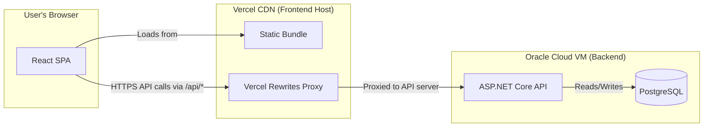
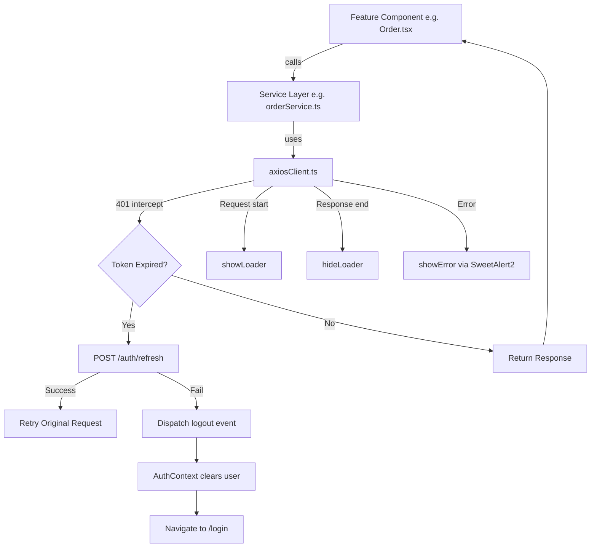

# 🖥️ SalesFlow UI
### 📂 Frontend Architecture & Design Case Study


This repository documents the architecture, design decisions, and engineering challenges behind the **SalesFlow** frontend — a production-grade, multitenant Sales & Order Management web portal built with **React 19**, **TypeScript**, and **Tailwind CSS**.

> [!NOTE]
> The underlying source code of this application is proprietary and confidential. This repository is dedicated to documenting the architectural decisions, component design patterns, and advanced frontend implementations used to build the system.

---

## 🚀 Executive Summary

SalesFlow UI is the client-side portal through which sales teams manage their customers, products, product units, and orders. It is deployed on **Vercel** and communicates with a dedicated ASP.NET Core API backend.

Rather than treating the frontend as a collection of CRUD forms, the architecture prioritizes:

- **Security by Default**: Silent JWT refresh with automatic logout dispatch keeps sessions alive without exposing token logic to individual components.
- **Reusable Component System**: A custom UI library (Table, Input, Select, Upload, DatePicker, ConfirmModal, Button) is built in-house, keeping the codebase consistent and eliminating third-party UI framework dependencies.
- **Type Safety Across All Boundaries**: Every API response, form state, and component prop is fully typed with TypeScript — including a centralized `types/` barrel that enforces consistent shape contracts across features.
- **Resilient API Communication**: A single Axios instance with request/response interceptors handles global loading states, automatic token refresh, error surfacing, and logout orchestration — no individual component needs to handle any of this.

---

## 🛠️ Technology Stack

| Category | Technology |
|---|---|
| **Framework** | React 19 |
| **Language** | TypeScript 5.9 |
| **Build Tool** | Vite 8 |
| **Styling** | Tailwind CSS 3.4 |
| **Routing** | React Router DOM 7 |
| **HTTP Client** | Axios 1.15 |
| **Icons** | Lucide React |
| **Alerts / Toasts** | SweetAlert2 |
| **Date Picker** | React DatePicker |
| **Deployment** | Vercel |

---

## 🌐 System Context



> [!NOTE]
> All API requests from the browser are proxied through Vercel's rewrite rules to the backend VM. This eliminates CORS issues in production and allows the API origin to change without touching application code.

---

## 📁 Project Structure

<details>
<summary>View project structure</summary>

```
src/
├── api/              # HTTP service modules (one per domain)
│   └── axiosClient.ts    # Shared Axios instance with interceptors
├── components/
│   ├── ui/           # Reusable UI primitives (Button, Table, Input, Upload…)
│   └── utils/        # Shared utilities (alert/loader service)
├── Features/         # Domain feature modules (Customer, Order, Product…)
├── layouts/          # App shell, sidebar, header, route guards
├── pages/            # Full-page routes (Login, Dashboard…)
├── types/            # Centralized TypeScript definitions (barrel export)
├── AuthContext.tsx   # Global auth state + session bootstrap
├── ProtectedRoute.tsx
└── App.tsx
```

</details>

---

## 🔐 Authentication Architecture

Authentication is handled through **HttpOnly cookie-based JWT** with automatic silent refresh. No token string is ever stored in `localStorage` or `sessionStorage` — the cookie is managed entirely by the browser and the server.

### Session Bootstrap Flow

On every page load (except public routes), `AuthContext` calls a session validation endpoint to confirm the cookie is still valid and populate the user context. This establishes a single source of truth for authentication state without relying on any stored token string:

```typescript
// AuthContext.tsx — validates session on mount
const initializeAuthSession = async () => {
    try {
        const response = await axiosClient.get('auth/me');
        setUser(response.data.responseData);
    } catch {
        setUser(null);
    } finally {
        setLoading(false);
    }
}
```

### Automatic Token Refresh (Axios Interceptor)

The response interceptor in `axiosClient.ts` intercepts `401 Unauthorized` responses and silently attempts a token refresh **before propagating the error** to the calling component. If the refresh succeeds, the original request is retried transparently. If it fails, a browser-level `logout` event is dispatched:

```typescript
// axiosClient.ts — silent refresh with request queue
if (error.response?.status === 401 && !originalRequest._retry && !isAuthRoute) {
    originalRequest._retry = true;
    if (isRefreshing) {
        // Queue concurrent requests while refresh is in-flight
        return new Promise((resolve, reject) => {
            failedQueue.push({ resolve, reject });
        }).then(() => axiosClient(originalRequest));
    }
    isRefreshing = true;
    try {
        await axiosClient.post('auth/refresh');
        processQueue();
        return axiosClient(originalRequest); // Retry original request
    } catch (err) {
        processQueue(err);
        window.dispatchEvent(new Event("logout")); // Global logout signal
    }
}
```

### Request Queue Under Concurrent Refresh

A key detail: if **multiple requests** fire simultaneously with an expired token, only **one** refresh call is made. The rest are queued in `failedQueue` and retried together once the refresh resolves. Without this, a page that makes 3 API calls on mount would trigger 3 simultaneous refresh attempts.

### Logout Event Bus

`AuthContext` listens for the `"logout"` window event. This decouples the Axios interceptor (which lives outside React's component tree) from the auth state, avoiding circular imports:

```typescript
window.addEventListener("logout", handleLogout);
```

---

## 🧩 Component Architecture

### Generic Table with Dual Layout

The `Table<T>` component is fully generic — it accepts typed `data`, a `renderRow` function, and an optional `renderCard` for mobile. This means every list page (Orders, Products, Customers) shares the exact same pagination logic and layout chrome without duplicating it:

```typescript
// Table accepts any data type — no any[] casting needed
<Table<order>
    header={header}
    data={orders}
    mobileLayout="card"
    renderRow={(row) => (
        <>
            <td>{row.orderNo}</td>
            <td>{row.customer}</td>
        </>
    )}
    renderCard={(row) => <OrderCard order={row} />}
    applyPagination={true}
    pagination={pagination}
    totalCount={totalCount}
    setPagination={setPagination}
/>
```

- **Desktop**: standard scrollable `<table>` layout
- **Mobile** (`mobileLayout="card"`): renders a card-based layout using `renderCard` prop — the table columns are hidden below `md` breakpoint

### Client-Side Image Compression (`Upload.tsx`)

The image upload component performs **in-browser compression before uploading**, capping images at 1200×1200px and re-encoding to JPEG at 80% quality. This reduces upload sizes from multi-MB phone photos to typically under 200KB without any server-side processing:

```typescript
// Upload.tsx — compress via Canvas API before upload
canvas.toBlob(
    (blob) => {
        const compressedFile = new File([blob], `upload_${Date.now()}.jpg`, {
            type: "image/jpeg",
            lastModified: Date.now(),
        });
        onChange(compressedFile); // Replace form file with compressed version
    },
    "image/jpeg",
    0.8  // 80% quality
);
```

**Android-specific bug fixed**: On Android Chrome, accessing `file.size` or `file.name` before calling `reader.readAsDataURL()` invalidates the temporary file descriptor from gallery apps. The component reads the file into memory first, then validates size/type — matching the order that works across all mobile browsers.

### Real-Time Order Total Calculation

The `AddUpdateOrder` form computes subtotals, order-level discounts, proportional tax, and gross totals **entirely in the browser** via a `useEffect` that fires on every change to `orderDetails` or `discountPercentage`. This mirrors the same calculation logic used on the API server — ensuring what the user sees in the form matches what gets saved:

```typescript
useEffect(() => {
    calculateFooters(); // Recalculates subtotal, discount, tax, gross on every change
}, [orderDetails, form.discountPercentage]);
```

### Parallel Dropdown Loading

Both customer and product dropdown lists are fetched in parallel using `Promise.all` when the Add/Edit Order modal opens — preventing a waterfall of sequential requests:

```typescript
const [customerData, productData] = await Promise.all([
    fetchCustomerDropdownValues(),
    fetchProductDropdownValues(),
]);
```

---

## 🔁 Data Flow Architecture



---

## ⚖️ Architectural Decision Log & Trade-offs

### 1. In-House UI Components vs. Shadcn / MUI
- **The Options**: Use a pre-built component library (Material UI, Shadcn/UI, Ant Design) vs. build a minimal custom component set.
- **The Trade-off**: Pre-built libraries ship large bundles and impose opinionated styling that is difficult to override without fighting the framework. Custom components require more initial build time but give total control over behavior and markup.
- **The Decision**: **Custom UI primitives built on Tailwind CSS**. The entire component library (`Button`, `Input`, `Select`, `Table`, `Upload`, `DatePicker`, `ConfirmModal`) fits in under 30KB of source. Every component is typed, accepts only the props it needs, and produces exactly the markup the design requires.

### 2. Cookie-Based Auth vs. localStorage JWT
- **The Options**: Store JWT in `localStorage` and attach it via `Authorization` header, or use `HttpOnly` cookies managed by the server.
- **The Trade-off**: `localStorage` tokens are accessible to JavaScript — any XSS vulnerability exposes the token. `HttpOnly` cookies are immune to JavaScript access but require the API to set `SameSite`/`Secure` attributes correctly and the frontend to send `withCredentials: true`.
- **The Decision**: **HttpOnly cookies**. Eliminating client-side token storage removes an entire class of token-theft attack vectors. The Axios instance is configured with `withCredentials: true` globally, so no per-request configuration is needed.

### 3. Vercel Proxy Rewrites vs. Direct API Calls
- **The Options**: Call the API origin directly from the browser (requiring CORS configuration), or proxy all API traffic through Vercel's rewrite rules.
- **The Trade-off**: Direct API calls expose the backend origin in browser network tabs and require maintaining CORS configuration on the server whenever the frontend origin changes. Vercel rewrites hide the backend origin and allow environment-specific routing (prod vs. dev) entirely in `vercel.json` without touching application code.
- **The Decision**: **Vercel rewrites**. All API traffic is routed through Vercel rewrite rules — routing is environment-aware based on request hostname, requiring no environment variable changes between deployments. The React application only ever calls relative paths — it has no knowledge of the backend's actual origin.

### 4. Centralized `types/` Barrel vs. Co-located Types
- **The Options**: Define TypeScript types inside the component or service file that uses them, or centralize all shared types in a `types/` directory with a barrel export.
- **The Trade-off**: Co-located types are convenient for small, single-use types but lead to duplication and import sprawl as the codebase grows. A centralized barrel requires discipline to maintain but produces a single, discoverable source of truth.
- **The Decision**: **Centralized `types/` with `index.ts` barrel**. Every form shape (`orderForm`, `ProductForm`), validation rule (`ValidationRule`), and API response type is defined once and imported everywhere via `import type { ... } from "../../types"`.

---

## 💥 Challenges Faced & Solutions

### Challenge 1: Silent Token Refresh with Concurrent Requests

- **The Problem**: When a user's JWT expires mid-session, the next request returns `401`. If the page makes multiple API calls simultaneously (e.g., loading dropdown data for the Order form in parallel), each of those 3+ requests independently intercepts the `401` and attempts a token refresh. This results in 3 simultaneous `POST /auth/refresh` calls — the first may succeed while the others fail with an already-used refresh token, logging the user out unexpectedly.

- **The Solution**: Implemented a **request queue** inside the Axios response interceptor using a module-level `isRefreshing` flag and `failedQueue` array. The first `401` to arrive sets `isRefreshing = true` and triggers the refresh. All subsequent `401`s during that window push a deferred `Promise` into `failedQueue`. Once the refresh resolves, `processQueue()` resolves all queued promises, and each retries its original request. This guarantees exactly one refresh call per expiry event regardless of how many requests fired simultaneously.

### Challenge 2: Android Chrome File Read Failure on Image Upload

- **The Problem**: On Android Chrome, when a user selects a photo from their gallery, the browser provides a temporary file descriptor. If JavaScript accesses `file.size` or `file.name` before the file's content is loaded into memory, the gallery app considers the descriptor "consumed" and invalidates it — causing `FileReader.readAsDataURL()` to fail silently with an `onError` event or produce an empty result.

- **The Solution**: Reordered the `Upload` component to call `reader.readAsDataURL(file)` immediately on file selection, before any property access. Only after `reader.onload` fires (confirming the file is safely in memory as a data URL) does the component check `file.size` and `file.type`. This matches the browser's expected access order and works correctly across all tested Android and iOS browsers.

### Challenge 3: Responsive Sidebar — Two Behaviors, One Component

- **The Problem**: The sidebar needs completely different behavior depending on screen size. On **desktop** (≥768px), it should remain visible and be collapsible to an icon-only rail via a toggle button. On **mobile** (<768px), it should be completely hidden off-screen and slide in as a drawer overlay when triggered. A single state variable cannot correctly represent both modes simultaneously.

- **The Solution**: `MainLayout` maintains two separate state variables — `isSidebarCollapsed` (desktop icon-rail mode) and `isSidebarOpen` (mobile drawer mode) — and the toggle function checks `window.innerWidth` to determine which to update:
    ```typescript
    const toggleSidebar = () => {
        if (window.innerWidth < 768) {
            setIsSidebarOpen(!isSidebarOpen); // Mobile: slide drawer in/out
        } else {
            setIsSidebarCollapsed(!isSidebarCollapsed); // Desktop: collapse to icon rail
        }
    };
    ```
    A backdrop overlay is rendered conditionally on mobile (`isSidebarOpen && <div className="fixed inset-0 bg-black/50 md:hidden" />`), and clicking it closes the drawer — matching the standard mobile navigation pattern.

---

## 🚀 Deployment

The application is deployed on **Vercel** with environment-based API routing via `vercel.json`. The rewrite config proxies all API traffic to the backend VM and uses a catch-all rule to support client-side routing:

```json
{
  "rewrites": [
    { "source": "/api/:path*", "destination": "https://<api-host>/api/:path*" },
    { "source": "/(.*)", "destination": "/" }
  ]
}
```

- **API proxy**: all `/api/*` requests are forwarded to the backend, keeping the server origin out of browser network tabs and removing the need for CORS configuration.
- **Hostname-based environment routing**: production and development API targets are selected based on the request hostname, requiring zero environment variable changes between deployments.
- **SPA catch-all**: the final `/(.*) → /` rule ensures React Router handles all navigation — without it, a hard refresh on any deep route returns a Vercel 404.

---

## 🎯 Engineering Philosophy

This frontend architecture reflects core values in building maintainable, scalable client applications:

- **Thin Components, Fat Services**: UI components own rendering and local state. They do not contain API call logic or token management — that belongs in the service and interceptor layers, respectively.
- **Type Everything That Crosses a Boundary**: Form state, API payloads, component props, and dropdown values all have explicit TypeScript types. This surfaces contract mismatches at compile time, not at runtime in production.
- **Security Requires Zero Trust in the Browser**: Storing sensitive tokens in `localStorage` or `sessionStorage` is a single XSS vulnerability away from a full session takeover. The architecture treats the browser as an untrusted environment and keeps all token material in `HttpOnly` cookies where JavaScript cannot reach it.
